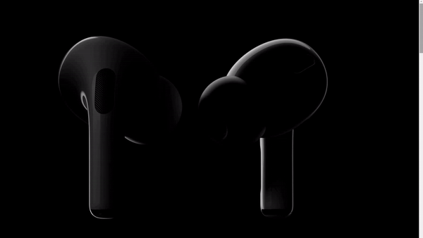

### :scroll: Fancy Scrolling

##### Learning how to implement this Fancy Scrolling just like in this  [css-tricks Tutorial](https://css-tricks.com/lets-make-one-of-those-fancy-scrolling-animations-used-on-apple-product-pages/) by [Jurn van Wissen ](https://css-tricks.com/author/jurnvanwissen/)on May 22, 2020 (Updated on May 25, 2020))

I just needed to change the function in the script:

* from:

`const scrollTop = html.scrollTop;`

* to:

`const scrollTop = document.body.scrollTop;`

Because the first one was getting only 0 value in any position of scrollbar. 

The result is awesome, try it yourself! 